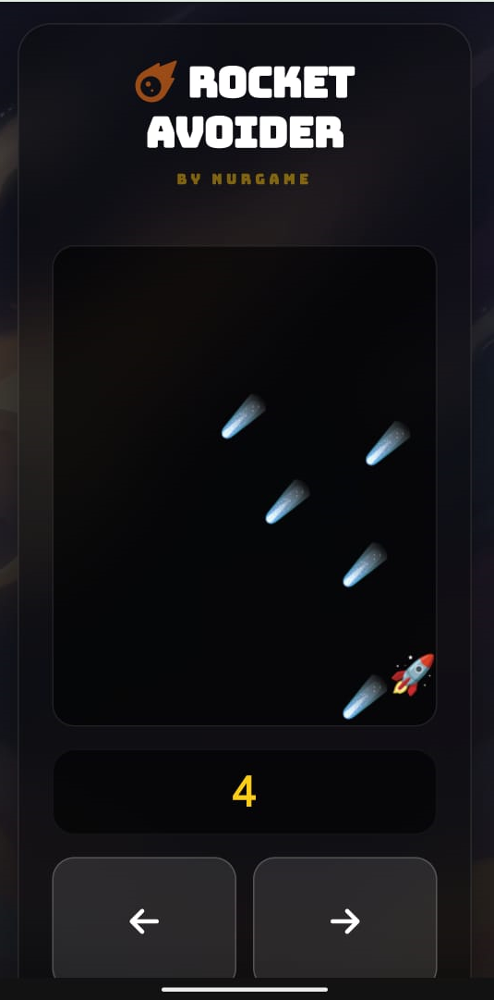

# 🚀 Rocket Avoider

|              Tampilan Desktop              |         Tampilan Mobile (D-Pad)          |
| :----------------------------------------: | :--------------------------------------: |
|  |  |

**[MAIN SEKARANG (LIVE DEMO)](https://nurjamilahh.github.io/rocket-avoider-nurgame/)**

**Rocket Avoider** adalah casual game yang mudah dimainkan dan untuk segala umur, kita hindari meteor dan raih skor tertinggi 🚀! Saya pakai bentuk meteor yang seperti lampu, supaya lebih terang 😃.  <br><br>
Game ini adalah salah satu kenang-kenangan saya belajar software engineering di kelas. <br><br> Kami ditugaskan memilih 3 (tiga) dari 4 (empat) game wajib dan ada satu game opsional. Dan ternyata inilah game yang paling saya sukai :smile:, karena mengingatkan saat saya memangku anak-anakku yang masih balita, bermain game semacam ini di PC jangkrik, dengan batu-batu meteor berjatuhan ke arah pesawat antariksa, yang berapi dan makin cepat jika levelnya semakin tinggi. Saat menyusun code game ini, saya sedang menanti cucu kedua. Buat saya, ini adalah suatu takdir yang aneh sekaligus sangat menyenangkan! <br><br> Demi meningkatkan keamanan bermain, sudah saya tambahkan scurity code. Audio game: Retro Arcade Game Music dari HitsLab.  


## 🛠️ Teknologi yang Digunakan

- **HTML5 Canvas/DOM**: Untuk rendering elemen game.
- **Tailwind CSS v4**: Untuk desain antarmuka (UI) yang modern dan responsif.
- **TypeScript**: Untuk logika game yang aman dan terstruktur.

## 📱 Mobile-Friendly Architecture

Game ini telah dioptimalkan untuk perangkat seluler:

- 🎮 **Smart Mobile Controls:** Menggunakan sistem simulasi virtual arrows yang memungkinkan pemain mobile memiliki kontrol presisi yang sama dengan pemain desktop tanpa mengubah inti logika mesin game.

* **Responsive Layout:** Antarmuka game (UI) menggunakan Tailwind CSS v4 untuk penyesuaian otomatis di berbagai ukuran layar (HP, Tablet, hingga Desktop).
* **Touch Optimization:** Implementasi e.preventDefault() pada kontrol layar sentuh untuk mencegah scrolling yang tidak disengaja saat bermain.

## 🛡️ Security & Safety Features

Keamanan data pemain adalah prioritas dalam pengembangan game ini:

- **XSS Protection (Sanitization):** Nama pilot yang dimasukkan melalui callsign telah melalui proses sanitization menggunakan fungsi `this.sanitize()`. Ini memastikan tidak ada kode berbahaya (script injection) yang bisa dijalankan melalui sistem leaderboard.
- **Secure JSON Parsing:** Menggunakan blok `JSON.parse` dengan mekanisme fallback untuk mencegah aplikasi crash jika terjadi kerusakan format data pada Local Storage.
- **Data Integrity:** Sistem secara otomatis memvalidasi dan membatasi jumlah data skor hanya untuk 5 pilot terbaik menggunakan metode `slice(0, 5)`, menjaga penyimpanan browser tetap bersih dan efisien.

## 📁 Struktur Project

- `audio/`: Efek suara dan musik latar game.
- `dist/`: Berisi file JavaScript (.js) hasil compile yang dijalankan di browser.
- `images/`: Aset grafis game.
- `src/`: Berisi file sumber TypeScript (.ts).

## 🚀 Cara Menuangkan Project di VS Code

1. **Clone repository ini:**

   ```bash
   git clone [https://github.com/nurjamilahh/rocket-avoider-nurgame.git](https://github.com/nurjamilahh/rocket-avoider-nurgame.git)
   ```

2. **Instal dependensi:**

   ```bash
   npm install
   ```

3. **Compile TypeScript:** Untuk melakukan build sekali jalan.

   ```bash
   npm run build
   ```

   Atau untuk mode otomatis (watch mode):

   ```bash
   npm run watch
   ```

4. **Mainkan Game:** Klik kanan pada file `index.html` lalu pilih "Open with Live Server" agar game berjalan lancar lengkap dengan suara dan gambarnya.

🎮 Cara Bermain

- Isi Callsign (nama pilot) kamu.
- Klik tombol INITIALIZE untuk memulai misi.
- Hindari rintangan dan kumpulkan skor sebanyak mungkin untuk masuk ke daftar **Top Pilots**!

## 🚀 Pengembangan Berikutnya

Game ini masih sangat memerlukan pengembangan agar pengalaman bermainnya makin seru! Beberapa fitur yang tampaknya menarik untuk dikembangkan:

- [ ] **Animasi Efek Visual:** Implementasi sistem partikel untuk efek ledakan yang realistis saat roket bertabrakan dengan meteor.
- [ ] **Mode Tingkat Kesulitan:** Penambahan opsi pemilihan level (Easy, Medium, Hard) di awal permainan untuk menyesuaikan kecepatan rintangan.
- [ ] **Sistem Power-ups:** Implementasi item spesial yang muncul secara acak, seperti _Shield_ (pelindung sementara) atau _Speed Boost_ (akselerasi).
- [ ] **Global Leaderboard:** Integrasi dengan database (seperti Firebase atau Supabase) untuk menyimpan dan menampilkan skor pemain dari seluruh dunia secara _real-time_.

## 📬 Saran & Kendala

Saya sangat menghargai setiap saran dari para Pilot! Jika Anda menemukan kendala atau ingin menyampaikan feedback, silakan sampaikan ke:

* Email   : worknurjam@gmail.com
* WhatsApp: [](https://wa.me/6285782602672)

---

_This is part of the **Nurjam Projects** collection — exploring code, one experiment at a time._
